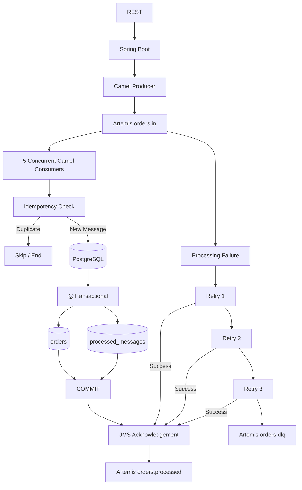
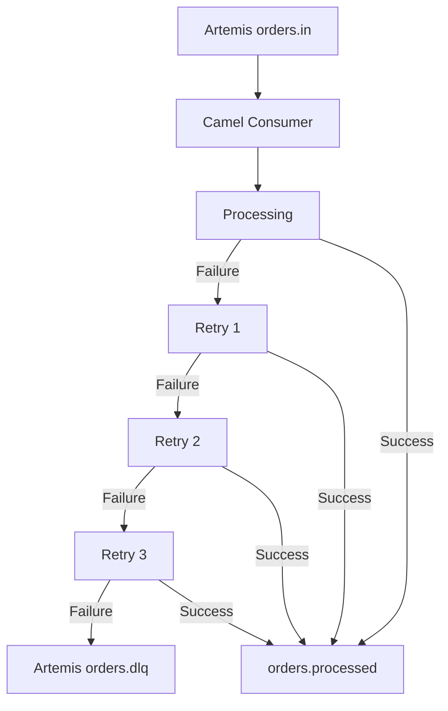
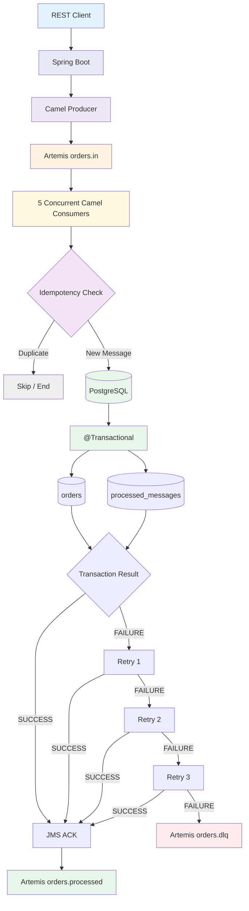

# Spring Boot + Camel XML DSL + Artemis + PostgreSQL

Java 21 / Spring Boot / Apache Camel XML DSL / ActiveMQ Artemis / PostgreSQL.

## XML DSL elements included

The route file intentionally demonstrates the requested XML constructs:

- `<beans>`
- `<routeContext>`
- `<route>`
- `<unmarshal>`
- `<setProperty>`
- `<setBody>`
- `<marshal>`
- `<choice>`
- `<when>`
- `<otherwise>`
- `<doTry>`
- `<doCatch>`
- `<onException>`

## Architecture

## Application Flow



## Retry and DLQ Flow



## End-to-End Order Processing Flow




```text
REST
  ↓
Spring Boot
  ↓
Camel Producer
  ↓
Artemis orders.in
  ↓
5 Concurrent Camel Consumers
  ↓
Idempotency Check
  ├── Duplicate → Skip
  │
  └── New
       ↓
   PostgreSQL
       ↓
   @Transactional
       ↓
   orders + processed_messages
       ↓
    SUCCESS
       ↓
    JMS ACK
       ↓
orders.processed

    FAILURE
       ↓
    Retry 1
       ↓
    Retry 2
       ↓
    Retry 3
       ├── SUCCESS → orders.processed
       │
       └── FAILURE → orders.dlq
```

## Run

Prerequisites: JDK 21, Maven 3.9+, Docker.

```bash
docker compose up -d
mvn spring-boot:run
```

## Success test

```bash
curl -X POST http://localhost:8080/api/orders \
  -H "Content-Type: application/json" \
  -H "Idempotency-Key: ORDER-KEY-1" \
  -d '{"orderNumber":"ORD-1001","customerName":"Alice","amount":2500.00}'
```

## Retry + DLQ test

`customerName=FAIL` intentionally throws an exception:

```bash
curl -X POST http://localhost:8080/api/orders \
  -H "Content-Type: application/json" \
  -H "Idempotency-Key: FAIL-KEY-1" \
  -d '{"orderNumber":"ORD-FAIL-1","customerName":"FAIL","amount":99.99}'
```

Camel retries three times with a 2-second delay and then routes the failed exchange to `orders.dlq`.

## Important transaction note

PostgreSQL work uses Spring `@Transactional`. The JMS consumer is configured as transacted. This example uses at-least-once delivery plus idempotency instead of XA/JTA distributed transactions. That keeps the sample simpler and is a common microservice reliability approach.

```text
Route file: src/main/resources/camel/order-routes.xml
```

```XML
<beans>
    <spring:bean>
    <camelContext>
        <onException>
        <routeContext>
            <route>
                <from>
                <setProperty>
                <setBody>
                <unmarshal>
                <marshal>

                <choice>
                    <when>
                    <otherwise>
                </choice>

                <doTry>
                    <doCatch>
                </doTry>

            </route>
        </routeContext>
    </camelContext>
</beans>
```

