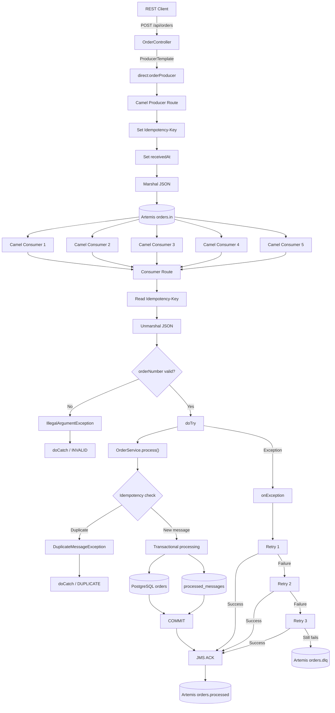
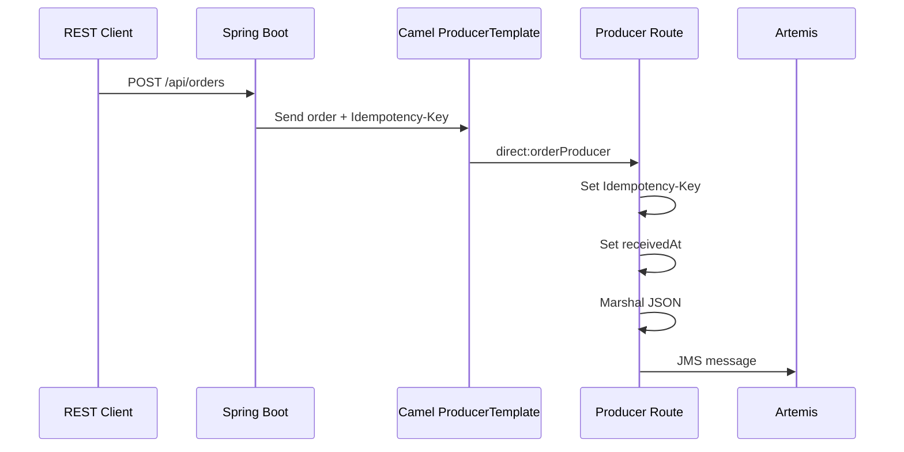
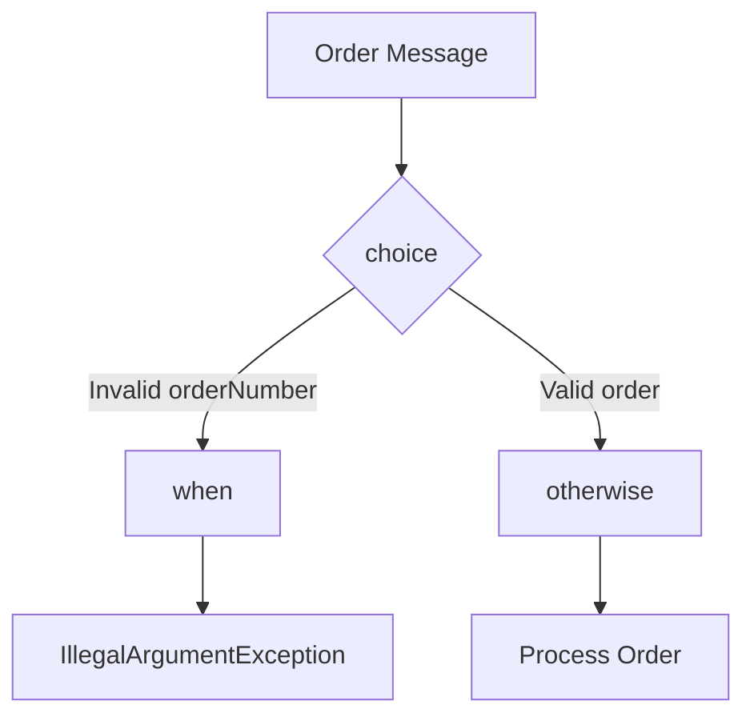
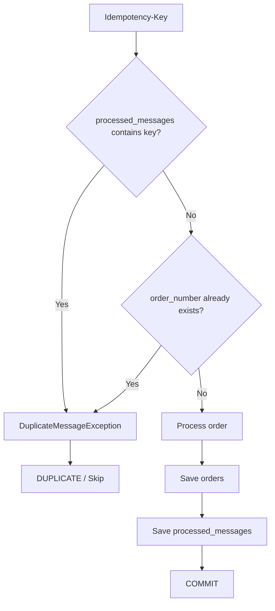
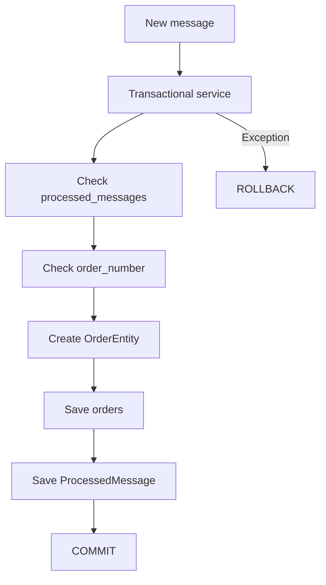
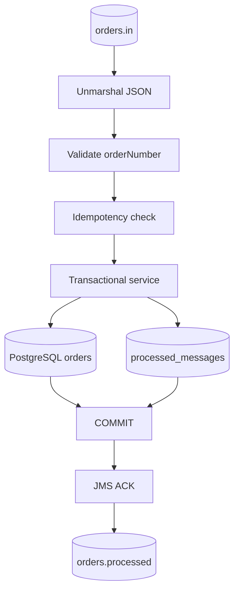
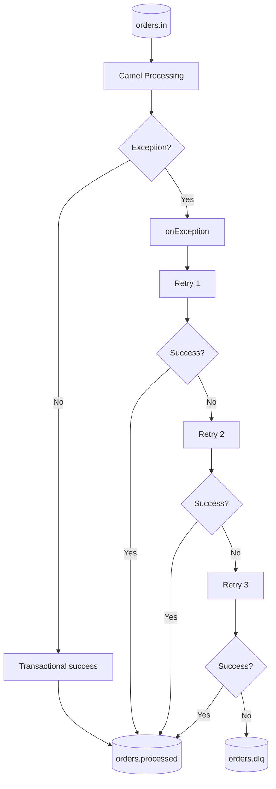
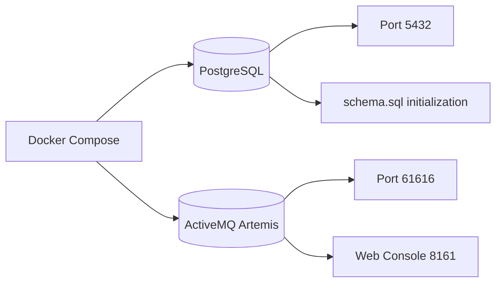
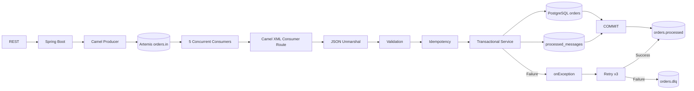

# Spring Boot + Apache Camel XML DSL + ActiveMQ Artemis + PostgreSQL

## 1. Overview

This project demonstrates an enterprise-style order-processing flow using:

- Spring Boot 3.5.6
- Java 21
- Apache Camel 4.14.0
- Camel XML DSL
- ActiveMQ Artemis
- PostgreSQL
- REST API
- Camel Producer / `ProducerTemplate`
- Five concurrent Camel consumers
- Jackson JSON marshal/unmarshal
- Idempotency using `processed_messages`
- Business duplicate protection using unique `orders.order_number`
- PostgreSQL transaction processing
- Camel exception handling
- Retry / redelivery
- Dead Letter Queue (DLQ)
- `orders.in`
- `orders.processed`
- `orders.dlq`

## 2. End-to-End Architecture



## 3. High-Level Data Flow

```text
REST
  |
  v
Spring Boot OrderController
  |
  v
Camel ProducerTemplate
  |
  v
direct:orderProducer
  |
  v
Artemis orders.in
  |
  v
5 concurrent Camel consumers
  |
  v
Camel consumer route
  |
  +--> JSON unmarshal
  |
  +--> Idempotency check
  |
  +--> Validation
  |
  +--> @Transactional service
          |
          +--> orders
          |
          +--> processed_messages
          |
          +--> COMMIT
  |
  v
JMS acknowledgement
  |
  v
Artemis orders.processed
```

Failure:

```text
orders.in
   |
   v
Camel processing
   |
   v
Exception
   |
   v
onException
   |
   v
Retry 1
   |
   v
Retry 2
   |
   v
Retry 3
   |
   +---- success ----> orders.processed
   |
   +---- failure ----> orders.dlq
```

## 4. REST → Camel Producer → Artemis

The request starts at the REST API. `OrderController` accepts the order and uses Camel's `ProducerTemplate` to enter the producer route.



The producer route prepares the message and sends it to:

```text
orders.in
```

## 5. Five Concurrent Consumers

The consumer route is documented with:

```text
orders.in?concurrentConsumers=5&transacted=true
```

Conceptually:

```text
                 +--> Consumer 1 --+
                 +--> Consumer 2 --+
orders.in -------+--> Consumer 3 --+--> Consumer Route
                 +--> Consumer 4 --+
                 +--> Consumer 5 --+
```

This allows multiple messages to be processed concurrently.

## 6. JSON Unmarshal

Artemis contains JSON. Camel converts it back to the Java order object:

```xml
<unmarshal>
    <json library="Jackson"/>
</unmarshal>
```

Flow:

```text
JSON
  |
  v
Jackson
  |
  v
OrderRequest
```

The documented request fields are:

- `orderNumber`
- `customerName`
- `amount`

## 7. Exchange Properties

The route uses an exchange property for the idempotency key:

```xml
<setProperty name="idempotencyKey">
    <simple>${header.Idempotency-Key}</simple>
</setProperty>
```

The value can then be accessed as:

```text
exchangeProperty.idempotencyKey
```

A `receivedAt` property is also set by the producer route.

## 8. Validation with choice / when / otherwise



The documented rule is that `orderNumber` is required.

Invalid input enters the local validation catch and produces an `INVALID` result.

Valid input continues to the processing block.

## 9. Transactional Business Processing

The documented service flow is:

```text
@Transactional
process(key, request)
       |
       +-- processed_messages contains key?
       |       |
       |       +-- Yes --> Duplicate
       |
       +-- orders contains orderNumber?
       |       |
       |       +-- Yes --> Duplicate
       |
       +-- customerName == FAIL?
       |       |
       |       +-- Yes --> SimulatedFailureException
       |
       +-- Save OrderEntity
       |
       +-- Save ProcessedMessage
       |
       +-- COMMIT
```

The two database writes are part of the transactional business processing.

## 10. Idempotency

Idempotency prevents a previously processed message from being processed again.



There are therefore two documented duplicate protections:

1. Message-level idempotency through `processed_messages`.
2. Business-level duplicate protection through unique `orders.order_number`.

## 11. PostgreSQL Data Model

### `orders`

| Column | Type | Purpose |
|---|---|---|
| `id` | `BIGSERIAL` | Primary key |
| `order_number` | `VARCHAR(100)` | Unique business order number |
| `customer_name` | `VARCHAR(150)` | Customer |
| `amount` | `NUMERIC(14,2)` | Order amount |
| `status` | `VARCHAR(40)` | Order status |
| `created_at` | `TIMESTAMP` | Creation timestamp |

### `processed_messages`

| Column | Type | Purpose |
|---|---|---|
| `message_key` | `VARCHAR(200)` | Idempotency key / primary key |
| `processed_at` | `TIMESTAMP` | Processing timestamp |

## 12. Transaction Flow



The intended atomic operation is:

```text
Order record
     +
Processed-message record
     |
     v
Same transaction
     |
     v
COMMIT
```

## 13. Successful Processing



Successful sequence:

1. Receive the message.
2. Unmarshal JSON.
3. Read/check the idempotency key.
4. Validate the order.
5. Check duplicates.
6. Save the order.
7. Save the processed-message marker.
8. Commit.
9. Acknowledge JMS.
10. Send successful output to `orders.processed`.

## 14. Exception Handling

The route has local and global exception handling.

### Local

The documented local catches handle:

```text
DuplicateMessageException
        |
        v
DUPLICATE

IllegalArgumentException
        |
        v
INVALID
```

### Global

The documented global policy is:

```text
Exception
   |
   v
Retry 1
   |
   v
Retry 2
   |
   v
Retry 3
   |
   v
DLQ
```

The documented policy uses:

```text
maximumRedeliveries = 3
redeliveryDelay     = 2000 ms
DLQ                 = orders.dlq
```

## 15. Retry and DLQ



## 16. Simulated Failure

The documented service intentionally raises `SimulatedFailureException` when `customerName` is `FAIL`, case-insensitively.

```text
customerName = FAIL
        |
        v
SimulatedFailureException
        |
        v
onException
        |
        +--> Retry 1
        |
        +--> Retry 2
        |
        +--> Retry 3
        |
        v
orders.dlq
```

This provides a repeatable way to demonstrate the retry/DLQ path.

## 17. Success Queue

After successful processing:

```text
PostgreSQL COMMIT
       |
       v
JMS ACK
       |
       v
orders.processed
```

## 18. DLQ

After the configured retries are exhausted:

```text
orders.in
   |
   v
Processing
   |
   v
Exception
   |
   v
Retry 1
   |
   v
Retry 2
   |
   v
Retry 3
   |
   v
orders.dlq
```

## 19. File Responsibilities

| File | Responsibility |
|---|---|
| `pom.xml` | Maven build, Java/Spring Boot/Camel versions and dependencies |
| `docker-compose.yml` | Local PostgreSQL and Artemis infrastructure |
| `README.md` | Architecture and project documentation |
| `explanation.html` | Generated project explanation |
| `OrderApplication.java` | Spring Boot entry point |
| `OrderController.java` | REST endpoint and message submission |
| `OrderRequest.java` | Order request DTO |
| `OrderEntity.java` | JPA mapping for `orders` |
| `ProcessedMessage.java` | JPA mapping for `processed_messages` |
| `OrderRepository.java` | Repository for orders |
| `ProcessedMessageRepository.java` | Repository for idempotency records |
| `OrderTransactionService.java` | Transactional business processing and duplicate checks |
| `application.yml` | PostgreSQL, Artemis, HTTP and Camel configuration |
| `order-routes.xml` | Camel producer/consumer orchestration, JSON conversion, validation, exception handling, retry and DLQ |
| `schema.sql` | PostgreSQL table definitions |

## 20. Runtime Configuration

Documented application settings include:

```text
Application:
    camel-artemis-xml-full-dsl

HTTP:
    localhost:8080

PostgreSQL:
    jdbc:postgresql://localhost:5432/ordersdb

Artemis:
    tcp://localhost:61616

JPA:
    validate

Camel:
    main-run-controller: true
```

The documented Docker environment uses:

```text
PostgreSQL:
    Port: 5432
    Database: ordersdb
    User: orders
    Password: orders

Artemis:
    Port: 61616
    Web console: 8161
    User: admin
    Password: admin
```

## 21. Docker Infrastructure



The documented Compose configuration uses persistent named volumes for PostgreSQL and Artemis.

## 22. Technology Stack

| Layer | Technology |
|---|---|
| API | Spring Boot Web |
| Language | Java 21 |
| Integration | Apache Camel 4.14.0 |
| Route format | Camel XML DSL |
| Messaging | ActiveMQ Artemis |
| Messaging API | JMS |
| Serialization | Jackson |
| Persistence | Spring Data JPA |
| Database | PostgreSQL |
| Reliability | Retry / Redelivery / DLQ |
| Duplicate protection | Idempotency key + unique order number |
| Transactions | Spring `@Transactional` |

## 23. End-to-End Example

Example request:

```http
POST /api/orders
Idempotency-Key: ORDER-1001-KEY
Content-Type: application/json
```

```json
{
  "orderNumber": "ORD-1001",
  "customerName": "John",
  "amount": 2500.00
}
```

Processing:

```text
REST
 |
 v
OrderController
 |
 v
ProducerTemplate
 |
 v
direct:orderProducer
 |
 v
JSON
 |
 v
orders.in
 |
 v
One of 5 consumers
 |
 v
Unmarshal
 |
 v
Idempotency check
 |
 v
Validation
 |
 v
@Transactional service
 |
 +--> orders
 |
 +--> processed_messages
 |
 v
COMMIT
 |
 v
JMS ACK
 |
 v
orders.processed
```

## 24. Duplicate Example

Submitting the same idempotency key again:

```text
orders.in
   |
   v
processed_messages
   |
   v
Key already exists
   |
   v
DuplicateMessageException
   |
   v
doCatch
   |
   v
DUPLICATE / Skip
```

The business order number is also protected by the unique constraint in `orders`.

## 25. Failure Example

For:

```json
{
  "orderNumber": "ORD-FAIL-001",
  "customerName": "FAIL",
  "amount": 1000.00
}
```

the documented simulated failure path is:

```text
orders.in
    |
    v
Consumer
    |
    v
OrderService
    |
    v
SimulatedFailureException
    |
    v
onException
    |
    +--> Retry 1
    |
    +--> Retry 2
    |
    +--> Retry 3
    |
    v
orders.dlq
```

## 26. Complete Architecture Summary



## 27. Important Implementation Note

The project materials describe the XML route as Camel Spring XML DSL while the POM documentation also identifies Camel XML IO DSL support. These are distinct route-loading mechanisms. They should not be mixed accidentally.

In particular, an application that uses Camel's XML IO route collector must have a matching XML IO DSL loader on the classpath, while a Spring XML file using `<beans>`, `<camelContext>` and `<routeContext>` belongs to the Spring XML DSL model.

Therefore, keep the route file format and the dependency/route-loader configuration consistent.

## 28. Final Takeaway

The complete reference flow is:

```text
REST
  ↓
Spring Boot Controller
  ↓
Camel ProducerTemplate
  ↓
Camel XML Producer Route
  ↓
Artemis orders.in
  ↓
5 Concurrent Camel Consumers
  ↓
Camel XML Consumer Route
  ↓
JSON Unmarshal
  ↓
Idempotency + Validation
  ↓
@Transactional Business Service
  ↓
PostgreSQL
  ├── orders
  └── processed_messages
  ↓
COMMIT
  ↓
JMS ACK
  ↓
orders.processed

Failure:
orders.in
  ↓
Exception
  ↓
onException
  ↓
Retry 1
  ↓
Retry 2
  ↓
Retry 3
  ↓
orders.dlq
```

This architecture demonstrates how REST, Camel, Artemis, concurrent consumers, idempotency, PostgreSQL transactions, exception handling, retry/redelivery and DLQ processing work together.
