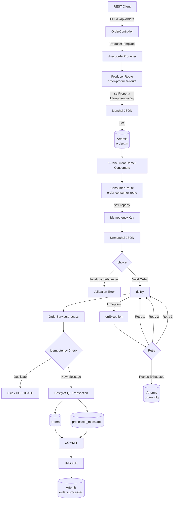
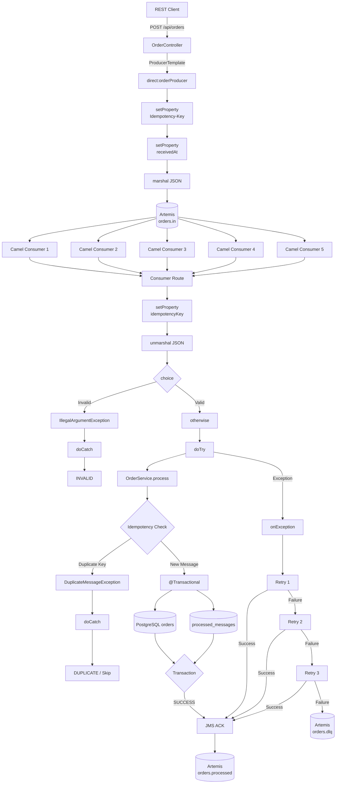
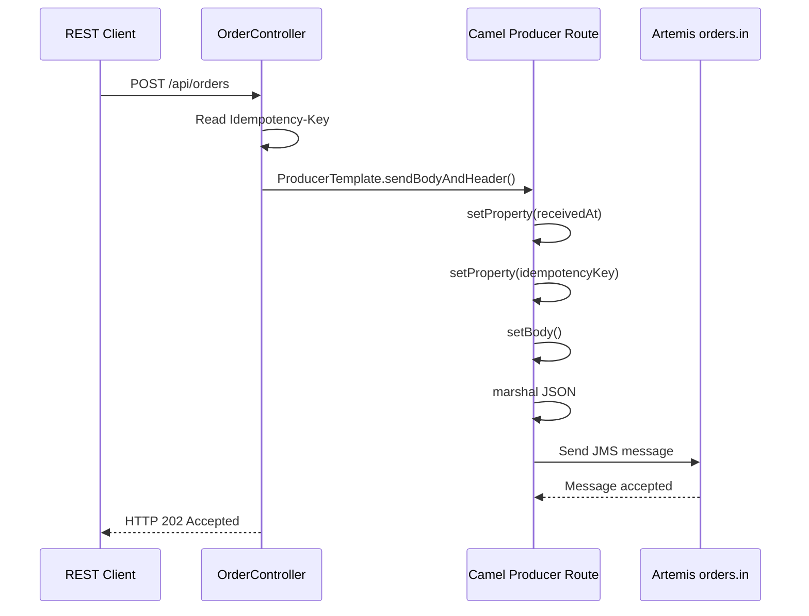
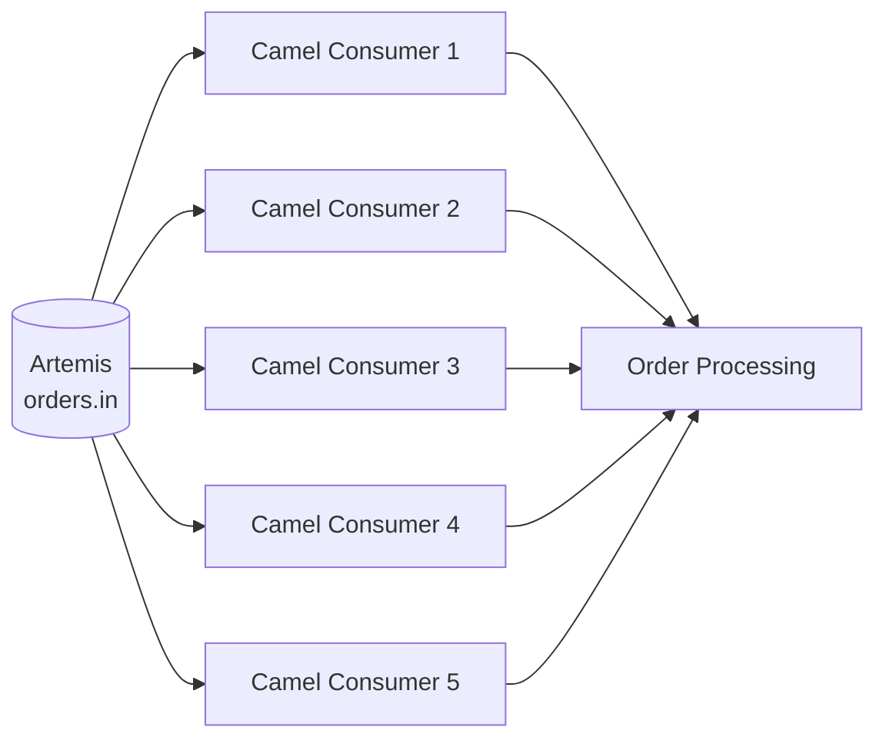
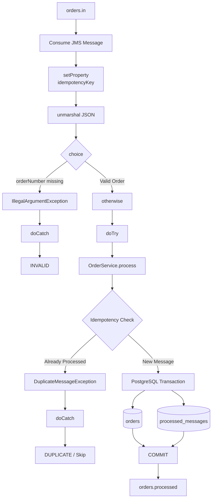
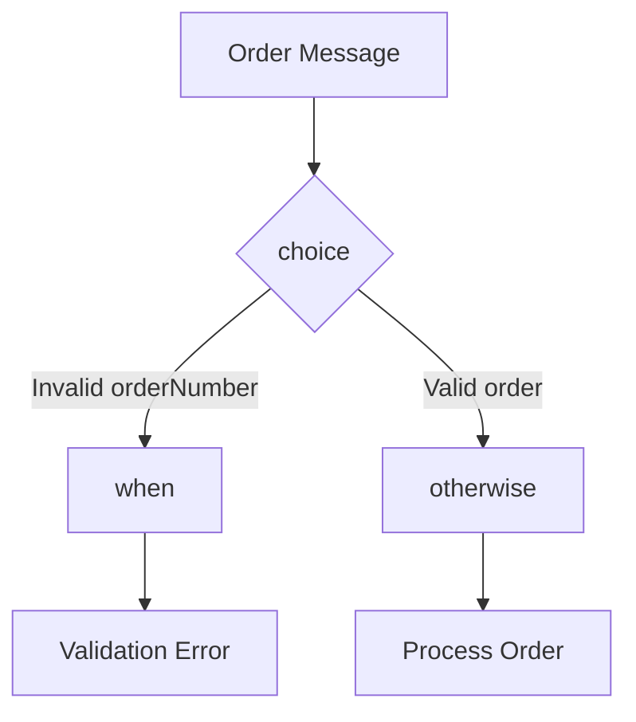
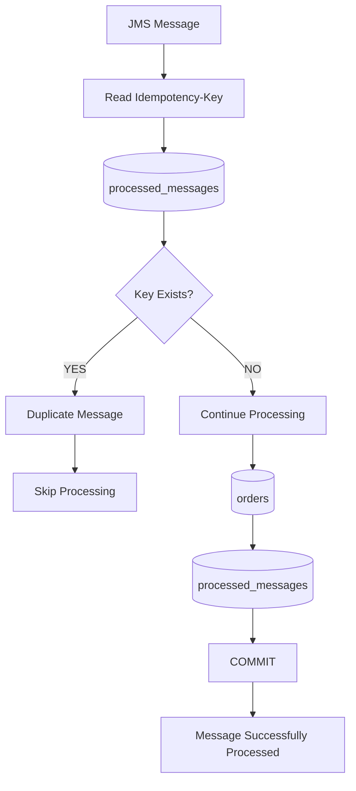
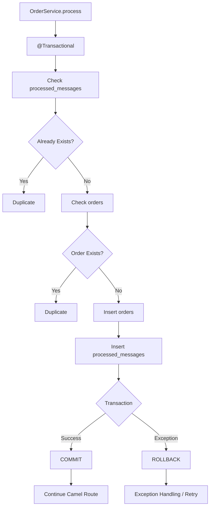
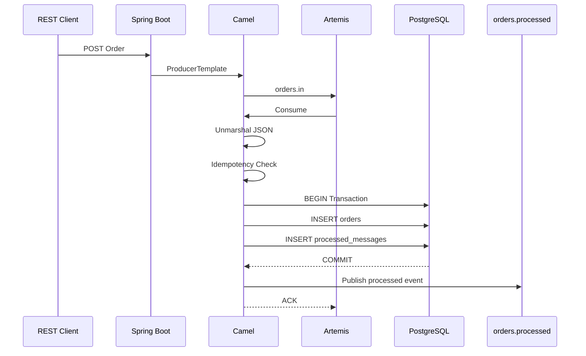
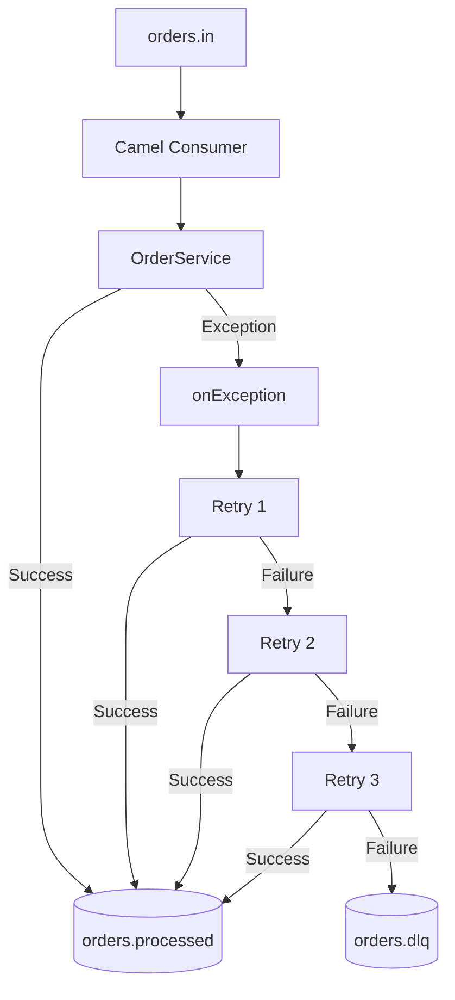

# Spring Boot + Apache Camel XML DSL + ActiveMQ Artemis + PostgreSQL

A runnable reference application demonstrating an enterprise-style order-processing flow using:

- Spring Boot
- Java 21
- Apache Camel
- Camel XML DSL
- ActiveMQ Artemis
- PostgreSQL
- REST API
- Camel Producer
- Multiple concurrent consumers
- Idempotency
- PostgreSQL transactions
- Camel exception handling
- Retry / redelivery
- Dead Letter Queue (DLQ)
- `orders.in`
- `orders.processed`
- `orders.dlq`

---

# 1. Architecture & Data Flow

The complete application flow is:



---

# 2. End-to-End Data Flow



---

# 3. REST → Camel Producer → Artemis



## What happens?

The REST client sends:

```http
POST /api/orders
Content-Type: application/json
Idempotency-Key: ORDER-1001-KEY
```

```text

header
-------
Idempotency-Key = KEY-12345

payload
---------
{
  "orderNumber": "ORD-12345",
  "customerName": "John Doe",
  "amount": 99.99
}
```

with:

```json
{
  "orderNumber": "ORD-1001",
  "customerName": "Alice",
  "amount": 2500.00
}
```

The request reaches:

```text
OrderController
```

The controller uses Camel `ProducerTemplate`:

```java
producerTemplate.sendBodyAndHeader(
    "direct:orderProducer",
    request,
    "Idempotency-Key",
    key
);
```

The XML producer route then:

1. Reads the idempotency key.
2. Stores properties on the Camel exchange.
3. Converts the Java object to JSON.
4. Sends the JSON message to Artemis `orders.in`.

---

# 4. Camel Producer XML Route

The producer route is defined in:

```text
src/main/resources/camel/order-routes.xml
```

Conceptually:

```xml
<route id="order-producer-route">

    <from uri="direct:orderProducer"/>

    <setProperty name="receivedAt">
        ...
    </setProperty>

    <setProperty name="idempotencyKey">
        ...
    </setProperty>

    <setBody>
        ...
    </setBody>

    <marshal>
        <json/>
    </marshal>

    <to uri="jms:queue:orders.in"/>

</route>
```

There is no Java `RouteBuilder`.

The routing logic is kept in XML.

---

# 5. Artemis → 5 Concurrent Consumers



The consumer route uses:

```text
concurrentConsumers=5
```

Therefore Camel can process up to five messages concurrently.

The XML configuration is conceptually:

```xml
<from uri="jms:queue:orders.in?concurrentConsumers=5&amp;transacted=true"/>
```

This gives the application:

- Parallel message consumption
- Higher throughput
- Independent processing of messages
- Transaction-aware JMS consumption

---

# 6. Consumer Processing Flow



The consumer route performs:

```text
JMS message
    ↓
setProperty
    ↓
unmarshal JSON
    ↓
choice
    ↓
validation
    ↓
doTry
    ↓
OrderService
    ↓
idempotency
    ↓
PostgreSQL
    ↓
orders.processed
```

---

# 7. XML DSL Components

The application demonstrates the requested Camel XML DSL elements.

## `<beans>`

The XML file starts with the Spring/Camel XML configuration:

```xml
<beans>
```

This is the root container for the XML configuration.

---

## `<bean>`

A Spring bean can be declared directly in XML:

```xml
<bean id="routeInfo" class="java.util.HashMap">
    ...
</bean>
```

The application services are also available as Spring beans through component scanning.

For example:

```text
OrderService
```

can be referenced by Camel using:

```text
ref="orderService"
```

---

## `<routeContext>`

The routes are grouped inside:

```xml
<routeContext id="orderRouteContext">
```

This keeps the XML routing configuration organized.

---

## `<route>`

Each Camel flow is represented by:

```xml
<route id="...">
```

The project contains:

```text
order-producer-route
order-consumer-route
```

---

# 8. `<unmarshal>`

The Artemis message contains JSON.

The consumer converts JSON back to a Java object:

```xml
<unmarshal>
    <json library="Jackson"/>
</unmarshal>
```

Data flow:

```text
JSON
 ↓
Jackson
 ↓
OrderRequest
```

---

# 9. `<setProperty>`

Camel exchange properties are used for values that need to travel through the route.

For example:

```xml
<setProperty name="idempotencyKey">
    <simple>${header.Idempotency-Key}</simple>
</setProperty>
```

The idempotency key is therefore available later in the route:

```text
exchangeProperty.idempotencyKey
```

---

# 10. `<setBody>`

The XML DSL uses `<setBody>` to control the Camel message body.

For example:

```xml
<setBody>
    <simple>${body}</simple>
</setBody>
```

It is also used to construct the output message:

```json
{
  "status": "PROCESSED",
  "idempotencyKey": "ORDER-1001-KEY"
}
```

---

# 11. `<marshal>`

The Java object is converted to JSON before being sent to Artemis:

```xml
<marshal>
    <json library="Jackson"/>
</marshal>
```

Flow:

```text
OrderRequest
     ↓
Jackson
     ↓
JSON
     ↓
Artemis
```

---

# 12. `<choice>`, `<when>`, `<otherwise>`

The consumer route performs conditional processing:



The `<when>` branch handles invalid input.

The `<otherwise>` branch performs normal processing.

---

# 13. `<doTry>` and `<doCatch>`

The main processing is protected by:

```xml
<doTry>
    ...
    <doCatch>
        ...
    </doCatch>
</doTry>
```

The application uses catches for:

### Duplicate messages

```text
DuplicateMessageException
```

The duplicate is logged and skipped.

### Validation errors

```text
IllegalArgumentException
```

The message is treated as invalid rather than being repeatedly retried.

---

# 14. Idempotency

Idempotency prevents the same message from creating duplicate database records.



The application uses two levels of duplicate protection.

## Technical idempotency

The table:

```text
processed_messages
```

contains:

```text
message_key
processed_at
```

`message_key` is the primary key.

Therefore:

```text
ORDER-1001-KEY
```

cannot be inserted twice.

## Business idempotency

The `orders` table has:

```sql
UNIQUE(order_number)
```

This prevents the same business order from being inserted twice.

---

# 15. PostgreSQL Transaction

The database operation is performed inside Spring:

```java
@Transactional
public void process(...)
```

The transaction covers:

```text
Check processed_messages
        ↓
Check orders
        ↓
Insert orders
        ↓
Insert processed_messages
        ↓
COMMIT
```

Diagram:



If the transaction fails:

```text
ROLLBACK
```

is performed.

This prevents partial database updates.

---

# 16. Success Flow



---

# 17. Exception Handling, Retry and DLQ



The global Camel exception handler is responsible for retries:

```xml
<onException>
    ...
    <redeliveryPolicy
        maximumRedeliveries="3"
        redeliveryDelay="2000"/>
    ...
    <to uri="jms:queue:orders.dlq"/>
</onException>
```

The configured behavior is:

```text
Initial attempt
      ↓
Failure
      ↓
Retry 1
      ↓
Failure
      ↓
Retry 2
      ↓
Failure
      ↓
Retry 3
      ↓
Failure
      ↓
orders.dlq
```

The retry delay in this example is:

```text
2000 ms = 2 seconds
```

---

# 18. Retry Test

The application contains a deliberate failure condition for testing.

If:

```json
{
  "customerName": "FAIL"
}
```

is sent, the service throws:

```text
RetryableOrderException
```

Example:

```bash
curl -X POST http://localhost:8080/api/orders \
  -H "Content-Type: application/json" \
  -H "Idempotency-Key: FAIL-KEY-1" \
  -d "{\"orderNumber\":\"ORD-FAIL-1\",\"customerName\":\"FAIL\",\"amount\":99.99}"
```

The expected flow is:

```text
orders.in
   |
   v
Processing
   |
   X
   |
Retry 1
   |
   X
   |
Retry 2
   |
   X
   |
Retry 3
   |
   X
   |
orders.dlq
```

---

# 19. Complete Application Flow


---

# 20. Code-to-Flow Mapping

| Flow | Source |
|---|---|
| REST API | `OrderController.java` |
| Camel Producer | `direct:orderProducer` |
| Producer route | `order-routes.xml` |
| Artemis input | `orders.in` |
| Multiple consumers | `concurrentConsumers=5` |
| JSON conversion | `<marshal>` / `<unmarshal>` |
| Exchange properties | `<setProperty>` |
| Message body | `<setBody>` |
| Conditional routing | `<choice>` / `<when>` / `<otherwise>` |
| Local exception handling | `<doTry>` / `<doCatch>` |
| Global exception handling | `<onException>` |
| Retry | `<redeliveryPolicy>` |
| Database transaction | `OrderService.process()` + `@Transactional` |
| Idempotency | `processed_messages` |
| Business duplicate protection | `orders.order_number UNIQUE` |
| Successful output | `orders.processed` |
| Failed messages | `orders.dlq` |

---

# 21. Project Structure

```text
spring-camel-artemis-postgres-xml-dsl/
│
├── pom.xml
├── docker-compose.yml
├── README.md
│
└── src/
    └── main/
        ├── java/
        │   └── com/example/orders/
        │       ├── OrderApplication.java
        │       │
        │       ├── api/
        │       │   └── OrderController.java
        │       │
        │       ├── model/
        │       │   └── OrderRequest.java
        │       │
        │       ├── entity/
        │       │   ├── OrderEntity.java
        │       │   └── ProcessedMessage.java
        │       │
        │       ├── repository/
        │       │   ├── OrderRepository.java
        │       │   └── ProcessedMessageRepository.java
        │       │
        │       └── service/
        │           └── OrderService.java
        │
        └── resources/
            ├── application.yml
            ├── schema.sql
            │
            └── camel/
                └── order-routes.xml
```

---

# 22. Main XML Route

The complete Camel routing configuration is located at:

```text
src/main/resources/camel/order-routes.xml
```

The route contains the requested XML DSL structure:

```xml
<beans>

    <bean/>

    <camelContext>

        <onException>
            ...
        </onException>

        <routeContext>

            <route>

                <from/>

                <setProperty/>

                <setBody/>

                <marshal/>

                <unmarshal/>

                <choice>

                    <when>
                        ...
                    </when>

                    <otherwise>
                        ...
                    </otherwise>

                </choice>

                <doTry>

                    ...

                    <doCatch>
                        ...
                    </doCatch>

                </doTry>

            </route>

        </routeContext>

    </camelContext>

</beans>
```

The project uses **unprefixed Camel XML elements** as requested.

---

# 23. Running the Application

## Prerequisites

Install:

- JDK 21
- Maven 3.9+
- Docker Desktop

Check Java:

```bash
java -version
```

Check Maven:

```bash
mvn -version
```

---

## Start PostgreSQL and Artemis

From the project root:

```bash
docker compose up -d
```

Check containers:

```bash
docker ps
```

You should have:

```text
orders-postgres
orders-artemis
```

---

## Start Spring Boot

```bash
mvn spring-boot:run
```

The application starts on:

```text
http://localhost:8080
```

---

# 24. Test Successful Order

```bash
curl -X POST http://localhost:8080/api/orders \
  -H "Content-Type: application/json" \
  -H "Idempotency-Key: ORDER-1001-KEY" \
  -d "{\"orderNumber\":\"ORD-1001\",\"customerName\":\"Alice\",\"amount\":2500.00}"
```

Expected flow:

```text
REST
 ↓
Spring Boot
 ↓
Camel Producer
 ↓
orders.in
 ↓
Camel Consumer
 ↓
Idempotency
 ↓
PostgreSQL
 ↓
COMMIT
 ↓
orders.processed
```

---

# 25. Test Idempotency

Send the same request again:

```bash
curl -X POST http://localhost:8080/api/orders \
  -H "Content-Type: application/json" \
  -H "Idempotency-Key: ORDER-1001-KEY" \
  -d "{\"orderNumber\":\"ORD-1001\",\"customerName\":\"Alice\",\"amount\":2500.00}"
```

The application checks:

```text
processed_messages
```

and detects:

```text
ORDER-1001-KEY
```

as already processed.

The duplicate is not inserted into the database.

---

# 26. Test Retry + DLQ

Send:

```bash
curl -X POST http://localhost:8080/api/orders \
  -H "Content-Type: application/json" \
  -H "Idempotency-Key: FAIL-KEY-1" \
  -d "{\"orderNumber\":\"ORD-FAIL-1\",\"customerName\":\"FAIL\",\"amount\":99.99}"
```

Because:

```text
customerName = FAIL
```

the service intentionally throws an exception.

The message goes through the configured retry policy.

After the configured retries are exhausted:

```text
orders.dlq
```

receives the failed message.

---

# 27. Artemis Queues

The application uses these queues:

| Queue | Purpose |
|---|---|
| `orders.in` | Incoming orders |
| `orders.processed` | Successfully processed orders/events |
| `orders.dlq` | Messages that failed after retries |

---

# 28. PostgreSQL Tables

## orders

```text
id
order_number
customer_name
amount
status
created_at
```

The important constraint is:

```sql
UNIQUE(order_number)
```

## processed_messages

```text
message_key
processed_at
```

The important constraint is:

```text
PRIMARY KEY(message_key)
```

---

# 29. Important Transaction Behavior

This sample uses:

```text
JMS transacted consumer
+
Spring @Transactional PostgreSQL processing
+
Idempotency
```

The application intentionally does **not** use XA/JTA distributed transactions.

Instead, it relies on:

```text
At-least-once JMS delivery
+
Database transaction
+
Idempotency
+
Unique database constraints
```

This is a common practical approach for microservices because it avoids the operational complexity of distributed XA transactions.

For stronger database/event atomicity, consider the **Outbox Pattern**.

---

# 30. Why Idempotency Is Important

JMS messaging can result in a message being delivered again.

For example:

```text
Message received
       ↓
Database transaction
       ↓
Application crashes before ACK
       ↓
Artemis redelivers message
```

Without idempotency:

```text
orders
ORD-1001
ORD-1001
ORD-1001
```

could potentially be created.

With idempotency:

```text
Message
   ↓
processed_messages
   ↓
Already exists?
   ↓
YES
   ↓
Skip
```

Therefore duplicate delivery does not create duplicate business data.

---

# 31. Production Considerations

For a production implementation, consider adding:

- Correlation ID
- Structured logging
- Distributed tracing
- Micrometer metrics
- Prometheus
- Grafana
- Artemis monitoring
- PostgreSQL connection pool tuning
- HikariCP tuning
- Retry backoff
- Exponential retry policy
- DLQ monitoring
- DLQ replay mechanism
- Outbox Pattern
- Schema migrations using Flyway or Liquibase
- Authentication and authorization
- API validation
- OpenAPI documentation
- Graceful shutdown
- Kubernetes readiness/liveness probes

---

# 32. Summary

The complete flow is:

```text
REST
 ↓
Spring Boot Controller
 ↓
Camel ProducerTemplate
 ↓
Camel XML Producer Route
 ↓
Artemis orders.in
 ↓
5 Concurrent Camel Consumers
 ↓
Camel XML Consumer Route
 ↓
Unmarshal JSON
 ↓
Idempotency Check
 ↓
choice / validation
 ↓
doTry
 ↓
@Transactional OrderService
 ↓
PostgreSQL
 ├── orders
 └── processed_messages
 ↓
COMMIT
 ↓
JMS ACK
 ↓
Artemis orders.processed
```

Failure flow:

```text
orders.in
 ↓
Camel Processing
 ↓
Exception
 ↓
onException
 ↓
Retry 1
 ↓
Retry 2
 ↓
Retry 3
 ↓
Still Failed
 ↓
orders.dlq
```

This provides a complete **REST → Camel → Artemis → concurrent consumers → idempotency → PostgreSQL transaction → processed event / retry → DLQ** reference architecture.
