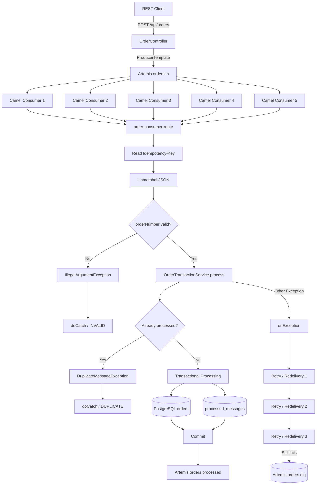
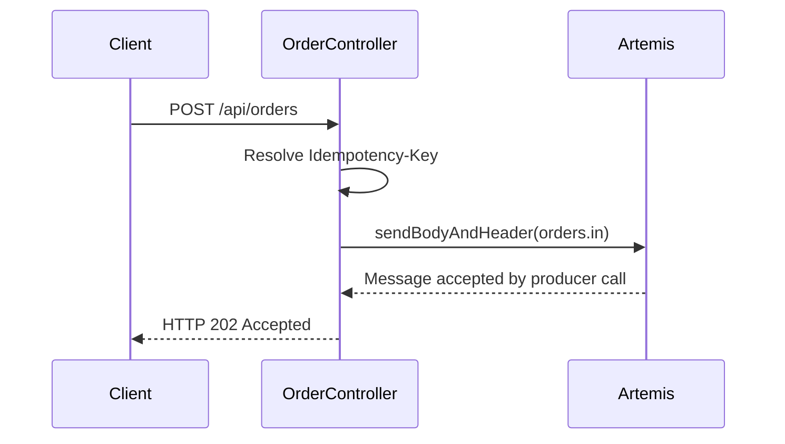
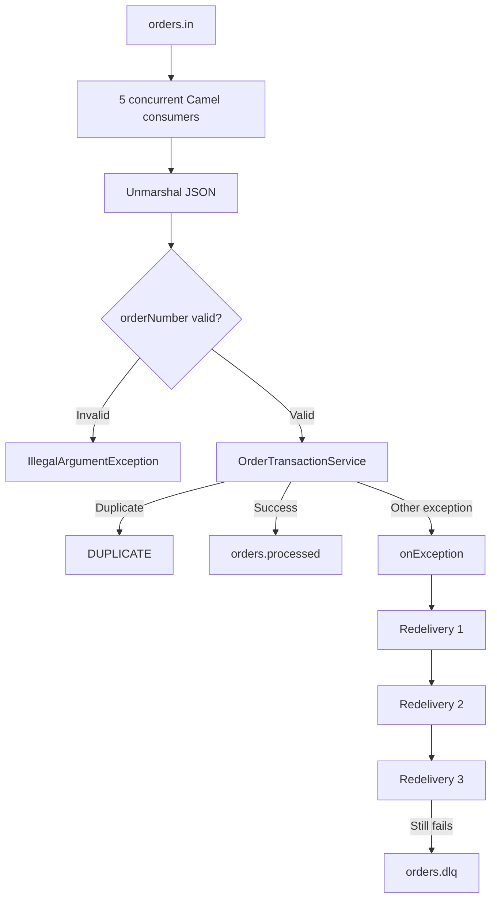
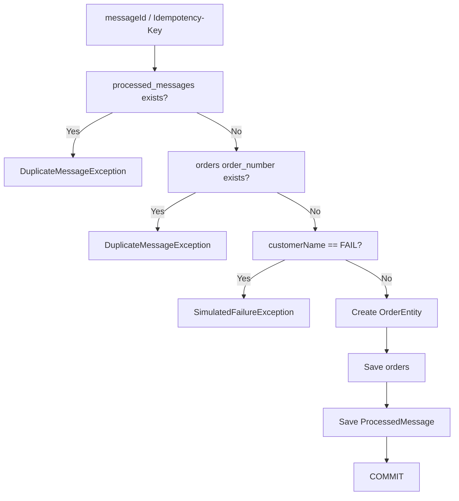

<!-- Converted from explanation2.html to Markdown README format. -->

# Complete Functionality Explanation

This document explains the files contained in spring-boot-camel-artemis-xml-dsl.zip . The explanation is grounded in the actual source/configuration files in the archive. The internal .git object database is repository metadata rather than application functionality, so it is inventoried separately below.

## 1. Project at a Glance

Failures from the service are eligible for Camel's global redelivery policy. The XML configures three redeliveries with a 2-second delay and a DLQ endpoint named orders.dlq .

## 2. Complete Mermaid Architecture



## 3. Actual Application Data Flow

1. OrderController receives POST /api/orders .
2. If the request has no Idempotency-Key , the controller creates a UUID.
3. The controller sends the OrderRequest directly to jms:queue:orders.in with the idempotency key as a JMS header.
4. The Camel XML consumer reads orders.in with concurrentConsumers=5 and transacted=true .
5. The route copies the header into exchange property messageId .
6. The message is unmarshalled with Jackson.
7. The route validates orderNumber .
8. The service checks both the processed-message key and the business order number.
9. A new order is saved to orders and its message key is saved to processed_messages in one Spring transaction.
10. The Camel route marshals the resulting body and sends it to orders.processed .

## 4. REST Request Sequence



The controller source actually sends directly to jms:queue:orders.in ; the XML producer-route starting at direct:orderProducer is also present in the project, but this controller does not invoke that direct endpoint.

## 5. Important Flow Detail: Controller vs XML Producer Route

`producer-route`

`direct:orderProducer`

`jms:queue:orders.in`

`direct:orderProducer`

## 6. Consumer and Retry Flow



## 7. Idempotency and Transaction Flow



The service method is annotated @Transactional . The source explicitly performs the processed-message check, order-number check, simulated failure check, order save and processed-message save inside that method.

## 8. File-by-File Explanation

| File | Functionality |
| --- | --- |
| README.md | Project README describing the intended architecture, flows, setup and examples. |
| apache-camel-masterclass.pdf | PDF reference material included in the archive. |
| docker-compose.yml | Local infrastructure: PostgreSQL and ActiveMQ Artemis containers, ports, credentials, volumes and database schema mount. |
| explanation.html | Previously generated HTML explanation included in the archive. |
| pom.xml | Maven build descriptor: Java/Spring Boot/Camel versions, dependency management and runtime dependencies. |
| src/main/java/com/example/orderapp/OrderApplication.java | Spring Boot application entry point. |
| src/main/java/com/example/orderapp/api/OrderController.java | REST endpoint that accepts an order and sends it to Artemis with an Idempotency-Key. |
| src/main/java/com/example/orderapp/entity/OrderEntity.java | JPA entity mapped to the orders table. |
| src/main/java/com/example/orderapp/entity/ProcessedMessage.java | JPA entity mapped to processed_messages; the message key is the identifier. |
| src/main/java/com/example/orderapp/model/OrderRequest.java | Input DTO containing orderNumber, customerName and amount. |
| src/main/java/com/example/orderapp/repository/OrderRepository.java | Spring Data JPA repository for OrderEntity, including order-number existence checking. |
| src/main/java/com/example/orderapp/repository/ProcessedMessageRepository.java | Spring Data JPA repository for ProcessedMessage. |
| src/main/java/com/example/orderapp/service/OrderTransactionService.java | Transactional business service implementing idempotency checks, duplicate checks, simulated failure, order persistence and processed-message persistence. |
| src/main/resources/application.yml | Spring Boot runtime configuration for application name, PostgreSQL, Artemis, server port and Camel. |
| src/main/resources/camel/order-routes.xml | Apache Camel Spring XML DSL orchestration: producer route, five concurrent JMS consumers, JSON conversion, validation, service invocation, local catches, global retry and DLQ. |
| src/main/resources/schema.sql | PostgreSQL schema for the orders and processed_messages tables. |

## README.md

Project README describing the intended architecture, flows, setup and examples.

The README is documentation for the project and contains Mermaid architecture/data-flow diagrams and usage explanations.

### View source/content

## apache-camel-masterclass.pdf

PDF reference material included in the archive.

This file is binary/non-text; its presence is documented, but its binary content is not reproduced.

## docker-compose.yml

Local infrastructure: PostgreSQL and ActiveMQ Artemis containers, ports, credentials, volumes and database schema mount.

### Infrastructure

- PostgreSQL 17 is exposed on port 5432 .
- PostgreSQL database/user/password are ordersdb / orders / orders .
- Artemis 2.40.0 is exposed on 61616 for messaging and 8161 for its web console.
- Artemis credentials are admin / admin .
- schema.sql is mounted into PostgreSQL initialization.
- Named volumes persist PostgreSQL and Artemis data.

### View source/content

## explanation.html

Previously generated HTML explanation included in the archive.

This is an earlier generated explanation page that is itself included in the archive.

### View source/content

## pom.xml

Maven build descriptor: Java/Spring Boot/Camel versions, dependency management and runtime dependencies.

### Build and dependency stack

- Spring Boot parent: 3.5.6
- Java: 21
- Apache Camel: 4.14.0
- Spring Web
- Spring Data JPA
- Spring Boot Artemis
- Camel Spring Boot
- Camel JMS
- Camel Jackson
- Camel XML IO DSL
- PostgreSQL JDBC driver

### View source/content

## src/main/java/com/example/orderapp/OrderApplication.java

Spring Boot application entry point.

### Startup

SpringApplication.run(OrderApplication.class,args) starts the Spring Boot application.

### View source/content

## src/main/java/com/example/orderapp/api/OrderController.java

REST endpoint that accepts an order and sends it to Artemis with an Idempotency-Key.

### Runtime behavior

```text
POST /api/orders
    ↓
Read Idempotency-Key
    ↓
If missing: generate UUID
    ↓
producer.sendBodyAndHeader("jms:queue:orders.in", order, key)
    ↓
HTTP 202 Accepted
```

### View source/content

## src/main/java/com/example/orderapp/entity/OrderEntity.java

JPA entity mapped to the orders table.

### Persistence mapping

OrderEntity maps to orders . It has an auto-generated Long ID, a unique/non-null order number, required customer name and amount, status, and creation timestamp.

### View source/content

## src/main/java/com/example/orderapp/entity/ProcessedMessage.java

JPA entity mapped to processed_messages; the message key is the identifier.

### Persistence mapping

ProcessedMessage maps to processed_messages . Its messageKey is the JPA identifier and processedAt records processing time.

### View source/content

## src/main/java/com/example/orderapp/model/OrderRequest.java

Input DTO containing orderNumber, customerName and amount.

### Input fields

- orderNumber
- customerName
- amount as BigDecimal

### View source/content

## src/main/java/com/example/orderapp/repository/OrderRepository.java

Spring Data JPA repository for OrderEntity, including order-number existence checking.

### Repository API

Extends JpaRepository<OrderEntity,Long> and provides existsByOrderNumber for business duplicate detection.

### View source/content

## src/main/java/com/example/orderapp/repository/ProcessedMessageRepository.java

Spring Data JPA repository for ProcessedMessage.

### Repository API

Extends JpaRepository<ProcessedMessage,String> , allowing lookup by the idempotency/message key.

### View source/content

## src/main/java/com/example/orderapp/service/OrderTransactionService.java

Transactional business service implementing idempotency checks, duplicate checks, simulated failure, order persistence and processed-message persistence.

### Business processing

```text
@Transactional
process(key, request)
    |
    +-- processed_messages contains key? → Duplicate
    |
    +-- orders contains orderNumber? → Duplicate
    |
    +-- customerName == FAIL? → SimulatedFailureException
    |
    +-- save OrderEntity
    |
    +-- save ProcessedMessage
    |
    +-- commit
```

### View source/content

## src/main/resources/application.yml

Spring Boot runtime configuration for application name, PostgreSQL, Artemis, server port and Camel.

### Runtime configuration

- Application name: camel-artemis-xml-full-dsl
- PostgreSQL URL: jdbc:postgresql://localhost:5432/ordersdb
- Artemis broker: tcp://localhost:61616
- Spring Boot HTTP port: 8080
- JPA schema mode: validate
- Camel Spring Boot main-run-controller: true

### View source/content

## src/main/resources/camel/order-routes.xml

Apache Camel Spring XML DSL orchestration: producer route, five concurrent JMS consumers, JSON conversion, validation, service invocation, local catches, global retry and DLQ.

### XML route behavior

```text
Global onException
    ├─ Exception: java.lang.Exception
    ├─ maximumRedeliveries: 3
    ├─ redeliveryDelay: 2000 ms
    └─ to: jms:queue:orders.dlq

producer-route
    direct:orderProducer
        ↓
    receivedAt property
        ↓
    Jackson marshal
        ↓
    orders.in

order-consumer-route
    orders.in?concurrentConsumers=5&transacted=true
        ↓
    messageId = Idempotency-Key
        ↓
    Jackson unmarshal
        ↓
    choice: orderNumber required
        ↓
    orderTransactionService.process(...)
        ↓
    Jackson marshal
        ↓
    orders.processed

Local catches:
    DuplicateMessageException → DUPLICATE response
    IllegalArgumentException  → INVALID response + handled=true
```

### View source/content

## src/main/resources/schema.sql

PostgreSQL schema for the orders and processed_messages tables.

### Database model

```text
orders
  id BIGSERIAL PRIMARY KEY
  order_number VARCHAR(100) NOT NULL UNIQUE
  customer_name VARCHAR(150) NOT NULL
  amount NUMERIC(14,2) NOT NULL
  status VARCHAR(40) NOT NULL
  created_at TIMESTAMP NOT NULL

processed_messages
  message_key VARCHAR(200) PRIMARY KEY
  processed_at TIMESTAMP NOT NULL
```

### View source/content

## 9. Repository Metadata

The archive also contains a .git/ directory with Git metadata, hooks, refs, logs and object files. Those files describe version-control history/state rather than application runtime behavior. They are therefore not treated as executable application components in this explanation.

## 10. Important Implementation Observation

`direct:orderProducer`

`jms:queue:orders.in`

`direct:orderProducer`

## 11. Failure Scenario

The service intentionally throws SimulatedFailureException when customerName equals FAIL , case-insensitively. That exception is not caught by either of the two local doCatch blocks shown in the XML, so it can reach the global onException policy.

```text
orders.in
   ↓
consumer
   ↓
OrderTransactionService
   ↓
customerName == FAIL
   ↓
SimulatedFailureException
   ↓
global onException
   ↓
up to 3 redeliveries
   ↓
orders.dlq
```

## 12. Final Summary

This project is a Spring Boot + Java 21 + Apache Camel + ActiveMQ Artemis + PostgreSQL order-processing sample. The Java layer exposes the REST endpoint and implements persistence/business processing. The XML layer orchestrates Camel messaging, JSON transformation, validation, concurrent Artemis consumption, local exception handling and global retry/DLQ behavior. Docker Compose supplies PostgreSQL and Artemis locally.

Generated from the uploaded archive: spring-boot-camel-artemis-xml-dsl.zip
